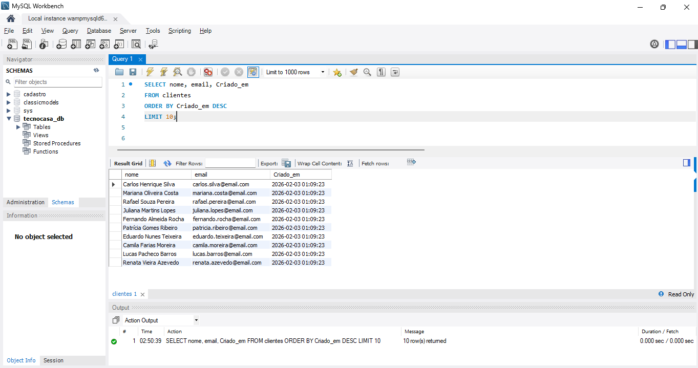
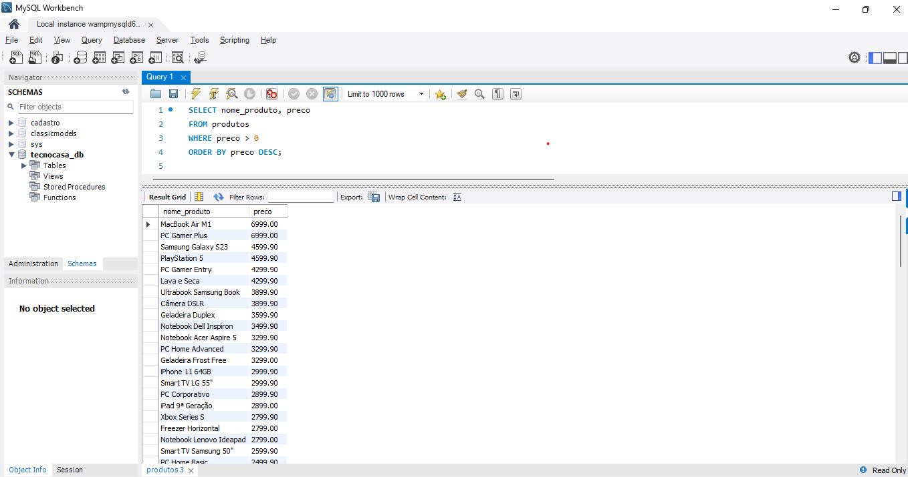
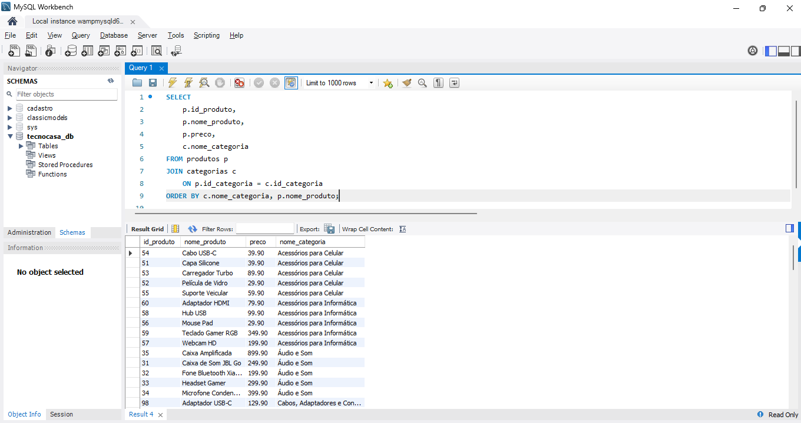
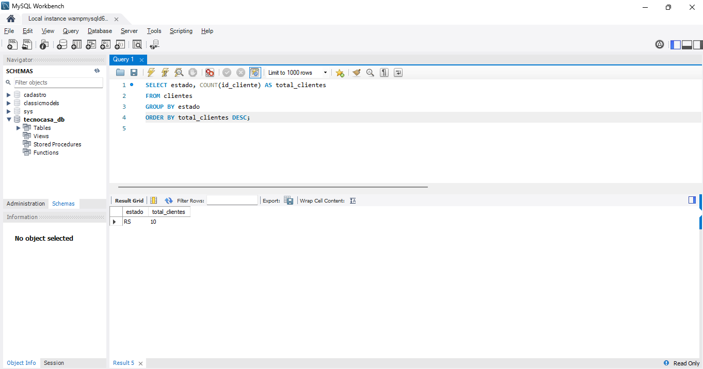
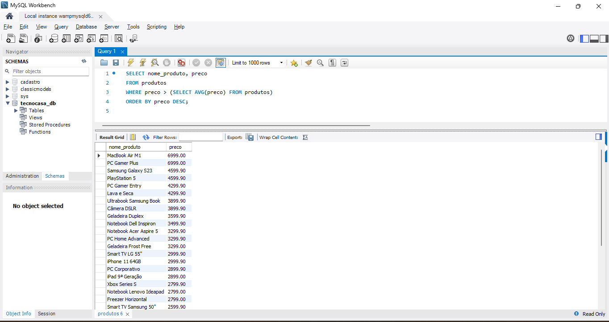
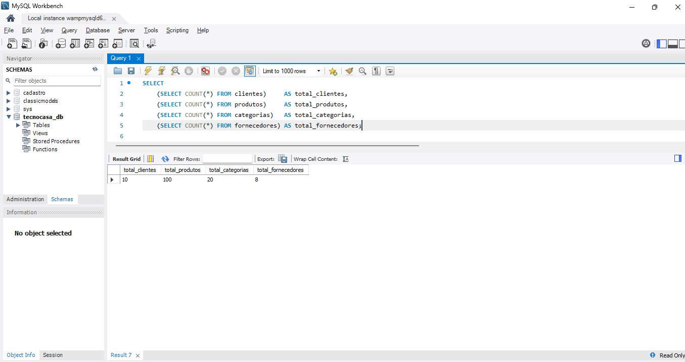

# 🛒 Sistema de Gestão de Loja – SQL

---

## 🌟 Sobre o Projeto

Este projeto **educativo e de portfólio** demonstra minhas habilidades em **SQL avançado** e **modelagem de dados**.  
Ele foi desenvolvido de forma incremental, mostrando **boa organização, consultas analíticas e otimização** do banco relacional.

---

## 📌 Versões do Projeto

| Versão | Descrição |
|--------|-----------|
| **v1.0** | Criação do banco de dados, tabelas e inserção de dados |
| **v1.1** | Consultas SQL para análise e extração de informações |
| **v1.2** | Aprimoramentos e consultas avançadas:  • Datas automáticas (`Criado_em`, `atualizado_em`)  • Índices (`idx_produtos_categorias`, `idx_clientes_estado`)  • Novas consultas: clientes recentes, atualizações, produtos positivos, produtos por categoria, clientes por estado, produtos acima da média, visão geral do banco |

---

## 📦 Estrutura do Banco de Dados

O banco contém **4 tabelas relacionais**:

- 🗂 **Categorias**  
- 🏢 **Fornecedores**  
- 👤 **Clientes**  
- 🛍 **Produtos**  

**Boas práticas aplicadas:**

- 🔑 Chaves primárias e estrangeiras  
- 🔄 Relacionamentos entre entidades  
- ✅ Regras de integridade (CHECK, NOT NULL)  
- 📋 Auditoria básica (`Criado_em`, `atualizado_em`)  

---

## 📊 Consultas SQL

- **v1.1** — Consultas básicas de análise de dados  
- **v1.2** — Consultas avançadas:
  - ⏱ Datas automáticas (`Criado_em`, `atualizado_em`)  
  - ⚡ Índices para consultas mais rápidas  
  - 💰 Filtragem de produtos com preço positivo (CHECK)  
  - 🔎 Subqueries para análises avançadas  
  - 🏷 Joins otimizados e agrupamentos por categoria/estado  

---

## 🖼️ Prints do Projeto

Cada print mostra consultas e resultados do banco, destacando **organização, análise e otimização de dados**.

1️⃣ **Clientes cadastrados recentemente**  
  
*"Top 10 clientes cadastrados recentemente, usando auditoria automática (`Criado_em`)."*

2️⃣ **Clientes atualizados recentemente**  
  
*"Clientes com alterações recentes, rastreadas via coluna `atualizado_em`."*

3️⃣ **Produtos com preço positivo (CHECK)**  
  
*"Produtos com preço maior que zero, aplicando regra de integridade CHECK."*

4️⃣ **Produtos por categoria (usando índice)**  
  
*"Produtos listados por categoria, otimização via índice `idx_produtos_categorias`."*

5️⃣ **Clientes por estado (usando índice)**  
  
*"Contagem de clientes por estado, índice `idx_clientes_estado` para performance."*

6️⃣ **Produtos acima da média de preço**  
  
*"Produtos com preço acima da média do catálogo, análise avançada com subquery."*

7️⃣ **Visão geral do banco (indicadores)**  
  
*"Indicadores gerais: total de clientes, produtos, categorias e fornecedores."*

---

## 🛠️ Tecnologias Utilizadas

- 🐬 MySQL  
- 💻 SQL  
- 🔗 GitHub (versionamento e organização de versões)  

---

## 🎯 Objetivo do Projeto

- Desenvolver habilidades práticas em:
  - Modelagem de banco de dados relacional  
  - Criação e manutenção de tabelas com boas práticas  
  - Consultas analíticas avançadas (joins, filtros, agregações, subqueries)  
  - Otimização com índices  
  - Auditoria de dados (`Criado_em`, `atualizado_em`)  
  - Documentação e versionamento profissional no GitHub  

---

## 📁 Organização dos Scripts

**v1.0/**  
00_create_database.sql
01_create_tables.sql
02_insert_categorias.sql
03_insert_fornecedores.sql
04_insert_clientes.sql
05_insert_produtos.sql

**v1.1/**  
01_consultas.sql

**v1.2/**  
alter_table_datas.sql -- Criado_em e atualizado_em
index_produtos_clientes.sql -- Criação de índices
01_consultas_v1.2.sql -- Consultas avançadas usando datas, CHECK e índices

---

## 👤 Autor

**Isaías Piazza Machado**

🔗 [GitHub do Projeto](https://github.com/Pyazzah/sistema-gestao-loja-sql/tree/main)
